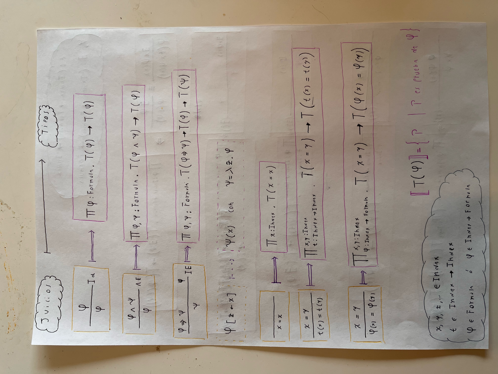
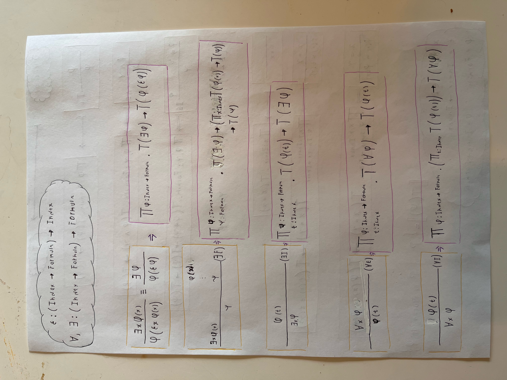

# Judgments-as-types
Using dependent types as a metalanguage with Idris2.

You can use a dependently typed language like Idris, Agda, Coq (gallina?), etc. as a metalangue for reasoning about 
formal systems (propositional logic, FOL, hoare logic, simply typed lambda calculus, etc.).  
This idea is the core of the Edinburgh Logical Framework (ELF).

## Curry-Howard 
| **Formal system**         | **Type theory** | **Marketing name**       |
|---------------------------|-----------------|--------------------------|
| theorem (formula)         | type            | _propositions-as-types_  |
| proof                     | term            | _proofs-as-programs_     |
| judgment (inference rule) | type            | _judgments-as-types_     |

# Propositional (classical) logic 

### Syntax

$$
 e \ ::= \ \neg e \ | \  e \Rightarrow e \ | \ e \wedge e 
$$

In idris is
 
```idris
data Formula : Type where
  Neg : Formula -> Formula
  Imp : Formula -> Formula -> Formula
  And : Formula -> Formula -> Formula

```

### Set of proofs 

We define that the set of proofs of a formula   $T(\phi) =$  { proof  | proof of $\phi$ } is inductively constructed by judgments. 

In idris we can define it with the following dependent type:
```idris
data T : Formula -> Type where
 -- The constructors of this type are the judgments of natural deduction  
```
Note that $t$ is a proof of $\phi$ if $t \in T(\phi)$ or, using Curry-Howard and Idris notation, if t : T ϕ

Lets define the judgments as constructors of the type T  
$\phi$  
▁ ( $Ident$ )  
$\phi$  
```idris
  Ident : T ϕ -> T ϕ
```

------------

   $[\phi]$                          
    ⋮  
  $\psi$                            
  ───    ( $ImpI$ )  
  $\phi \Rightarrow \psi$
 
 
 
 &nbsp;
 
 
  $\phi \Rightarrow \psi \ \ \ \ \ \ \phi $                                   
  ────── ( $ImpE$ )  
  $\psi$ 


```idris
  ImpI : (T ϕ -> T Ψ) -> T (ϕ `Imp` Ψ)
  
  ImpE : T (ϕ `Imp` Ψ) -> T ϕ -> T Ψ
```

------------
 
  $\phi \ \ \ \ \ \ \psi $                                   
  ──── ( $AndI$ )  
  $\phi \wedge \psi$ 
  
  &nbsp;
  
  
  $\phi \wedge \psi $                                   
  ──── ( $AndE1$ )  
  $\phi$ 
  
 &nbsp;
  
  
  $\phi \wedge \psi $                                   
  ──── ( $AndE1$ )  
  $\psi$ 
  

```idris
  AndI : T ϕ -> T Ψ -> T (ϕ `And` Ψ)
      
  AndE1 : T (ϕ `And` Ψ) -> T ϕ
       
  AndE2 : T (ϕ `And` Ψ) -> T Ψ
```

-----------

   $\[\phi\] \ \ \ \ \ \ \[\phi\]$                           
    $⋮            \ \ \ \ \ \ \ \ \ \      ⋮$  
  $\psi  \ \ \ \ \ \ \ \neg \psi$                            
  ────    ( $NegI$ )  
  $\neg \phi$
  
 &nbsp;
 
 $\neg \neg \phi$                            
 ──    ( $NegI$ )  
 $\phi$


```idris
  NegI : (T ϕ -> T Ψ) -> (T ϕ -> T (Neg Ψ)) -> T (Neg ϕ)  
  NegE : T (Neg $ Neg ϕ) -> T ϕ
```

The (NegE) is equivalent to the law of excluded middle, which in intuitionistic logic is illegal. The (NegI) is proof of negation which is legal in intuitionistic logic. [See](http://math.andrej.com/2010/03/29/proof-of-negation-and-proof-by-contradiction/).

### Proofs examples
Lets prove $(P \Rightarrow P)$, $(P \wedge Q \Rightarrow P)$ and $(P \wedge Q \Rightarrow Q)$
```idris

P, Q, R : Formula

proof1 : T (P `Imp` P)
proof1 = ImpI Ident


proof2 : T ((P `And` Q) `Imp` P)
proof2 = ImpI AndE1


proof3 : T ((P `And` Q) `Imp` Q)
proof3 = ImpI AndE2
```
For better understanding draw the natural deduction proof tree, the judgments names that are used are  
what you see in the terms (proofs) `proof1`, `proof2` and `proof3`. 
&nbsp;

Notice something, we are proving using dependent type theory as a metalanguage (propositional classical logic is the object language).  
It's not the same as proving using directly Curry-Howard. This would be the proofs using just Curry-Howard, notice the difference.

```idris
proof1 : { P : Type } -> P -> P
proof1 p = p

proof2 : { P , Q : Type } -> (P, Q) -> P
proof2 (a, b) = a

proof3 : { P, Q : Type } -> (P, Q) -> Q
proof3 (a, b) = b


```
The types here corresponds to formulas of an intuitionistic higer order logic. 

# First order logic
In propositional logic there are no variable binders, but in formal systems suchs as FOL or lambda calculus we have binders.  
With binders and substitution we have the problem of capture, we have to think about fresh variables, etc. when writing in paper is 
not as much of a problem but when we want to mechanize it with a computer we are challenged.  
One common solution, in lambda calculus, is to forget of named variables and use de Bruijn indexes or levels. 

The solutions that we will use here is really fast to implement and is easier, we will exploit the fact that the metalanguage (idris or the type theory behind it) has binders, and we will use it in the following way.

Suppose in a formula $\phi$ of the object language (FOL in this case) we want to substitute the variable $v$ for the expression $e$, i.e., $\phi [v := e ]$, we can define it in the following abstraction in the metalanguage $(\psi \ e)$ where $\psi = (\lambda v . \phi \ v)$, we let the $\beta$-reduction take care of the substitution.  

### Syntax
$e \ ::= t \ | \ \neg e \ | \  e \Rightarrow e \ | \ e \wedge e \ | \ \forall v . e \ | \ \exists v . e  | \ \epsilon v . e$  
$t \ ::= v \ | \  t = t \$  
$v \ ::= x, y, z, ...$

We are using a not so common presentation of FOL with $\epsilon$ the Hilbert Choice operator, we can think of this operator in this way:
if $(\exists x . \phi)$ holds then the we can find a witness $w = \epsilon (\exists x . \phi)$ such that $\phi(w)$ holds.  
This binder is at the terms levels of syntax, $\forall, \exists$ at the formula levels.  

This abstract syntax is represented a in Idris as follows,

At the level of variables, we let them range over an index, like $v \in Index$
```idris
Index : Type
```
For all formulas, except choice:  

```idris
data Formula : Type where
  -- Propositional connectives
  Neg : Formula -> Formula
  Imp : Formula -> Formula -> Formula
  And : Formula -> Formula -> Formula
  
  Equal : Index -> Index -> Formula
  
  -- The first order binders
  Forall : (Index -> Formula) -> Formula
  Exists : (Index -> Formula) -> Formula
```


As for $\epsilon$ we have it this way, outside the `Formula` type,  
```idris
Choice : (Index -> Formula) -> Index
```
Examples  
$(\forall x . x = x)$, $(\exists x . x = x)$ and  $\epsilon (x=x)$

Are
```Idris
Forall (\x => x `Equal` x) : Formula
Exists (\x => x `Equal` x) : Formula
Choice (\x => x `Equal` x) : Index
```
In this way we do not have to worry about $\alpha$-conversions because the metalanguage takes it care already. For instance,
```idris
Forall (\x => x `Equal` x)
Forall (\z => z `Equal` z)
Forall (\🍉 => 🍉 `Equal` 🍉)
```
Are all $\alpha$ equivalent.

### Set of proofs 
Again we define the set of proofs of a formula $T(\phi)$ as the following dependent type 
```idris
data T : Formula -> Type where
 -- The constructors of this type are all of the propositional logic case and the following new ones
```

                                   
  ── ( $Equal0$ )  
  $x=x$ 
  
  &nbsp;
    
   $x=y$  
   ──── ( $Equal1$ )  
  $t(x)=t(y)$ 
  
   &nbsp;
    
   $x=y \ \ \ \ \phi(x)$  
   ───── ( $Equal2$ )  
  $\phi(y)$

```idris
  Equal0 : {x : Index} -> T (x `Equal` x) 
  Equal1 : {t : Index-> Index} -> T (x `Equal` y) -> T ((t x) `Equal` (t y))
  Equal2 : {ϕ : Index -> Formula} -> T (x `Equal` y) -> T (ϕ x) -> T (ϕ y)
```
------

 $\exists x . \phi$  
   ──── ( $ChoiceI$ )  
  $\phi (\epsilon \phi)$ 

```idris
  ChoiceI : {ϕ : Index -> Formula} -> T (Exists ϕ) -> T (ϕ (Choice ϕ))  
```


------
```idris
  ExistsE : {ϕ : Index -> Formula} -> {Ψ : Formula}  -> T (Exists ϕ) -> (T (Exists ϕ) -> T Ψ) -> T Ψ
  ExistsI : {ϕ : Index -> Formula} -> {t : Index} -> T (ϕ t) -> T (Exists ϕ)   
```

------
```idris
  ForallE : {ϕ : Index -> Formula} -> {t : Index} -> T (Forall ϕ) -> T (ϕ t)
  ForallI : {ϕ : Index -> Formula} -> {t : Index} -> T (ϕ t) -> T (Forall ϕ)
```

### Proofs examples

# Cheat sheet
This is in spanish, so if you can't read it just learn spanish 👍  




# Bibliography
- Avron, Arnon & Honsell, Furio & Mason, Ian. (1996). An Overview of the Edinburgh Logical Framework. 10.1007/978-1-4612-3658-0_8. 
